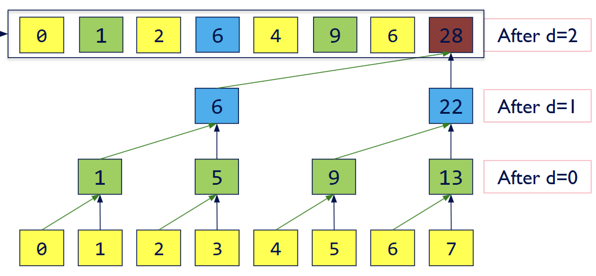

CUDA Stream Compaction
======================

**University of Pennsylvania, CIS 565: GPU Programming and Architecture, Project 2**

* Anthony Ge
  * [LinkedIn](https://www.linkedin.com/in/anthonyge/), [personal website](https://www.geant.pro)
* Tested on: Windows 11, i9-13900H @ 2600 Mhz 16GB, NVIDIA 
GeForce RTX 4070 Laptop GPU 8GB (personal)


## Parallel Algorithms Introduction
For this assignment, I implemented several parallel algorithms in CUDA, comparing results between CPU and GPU methods. The algoriths, which I'll describe, are:
- CPU Scan
- CPU Stream Compaction
- GPU Naive Scan
- GPU Work-Efficient Scan
- GPU Stream Compaction with Sscan

Under EC:
- GPU Optimized Work-Efficient Scan (EC)
- GPU Shared Memory Scan for Array Size < 2^14 (partial EC?)

We are particularly covering prefix-sum scans, where given an input array ```n``` and a binary associate operator, in our case a sum, and identity (0), we can output an array s.t each element is the result of the applying the operator on the previous element and the input element.

There are two scans we are concerned about: exclusive, which excludes element j of the input, using j-1 instead as input, and inclusive, which does.

```
Exclusive Scan:  Element j of the result does not include element j of the input:
- In:  [ 3  1  7  0  4  1  6  3]
- Out: [ 0  3  4 11 11 15 16 22]

Inclusive Scan (Prescan):  All elements including j are summed
- In:  [ 3  1  7  0  4  1  6  3]
- Out: [ 3  4 11 11 15 16 22 25]
```
*Example taken from CIS 5650 slides*

Our goal is to therefore implement different exclusive scans on GPU/CPU, and compare scalability and performance across the algorithms.

Along with scan, we also implemented stream compaction, which takes an array ```n``` and removes elements that fail a given boolean output function. In our use case, we keep elements if they are nonzero.

---
#### CPU Scan
Implementing scan on the CPU is very straightforward. We can set up a loop iterating from the 2nd element to the end, such that for element j, ```scan[j] = input[j-1] + scan[j-1]```, while also setting ```scan[0] = 0```.

In terms of analyzing base performance, we take ```O(n)``` time with ```n-1``` adds.

---
#### Naive GPU Scan
We can implement scan on the GPU using a series of passes that act on pairs of elements. For log(n) passes, we can modify our input array such that for an element j, and a given stride determined by stage number ```d``` from 0 to ```log(n)``` s.t ```strde = 2^(d-1)```, we let ```scan[j] = scan[j - stride] + scan[j]```.

The algorithm can be visualized as such in log passes:

*Image taken from GPU Gems 3, 39.2.1*

Eventually, we reach our final array after all passes, and return such as the scan result.

Performance wise, this gives us ```O(nlog(n))``` adds with ```O(log(n))``` algorithmic complexity derived from the number of dispatches called.

---
#### Work-efficient GPU Scan
We can further reduce the number of adds per stage using a balanced binary tree repreesentation of our array. Using this binary tree, we can perform two "sweeps", first an upsweep (parallel reduction), and then a downsweep.

The upsweep sums up pairs of left/right nodes to create parents s.t each parent node is a sum, where we will then repeat this paired sum in continual stages until we end up with one final sum, taking log(n) stages and dispatches. Note, however, that our adds is now ```O(n)```.


*Image taken from CIS 5650 slides*

The downsweep uses the partial sums computed from the upsweep result (observe the non-yellow cells in the above image) to reconstruct and build our final scanned array. We first clear the last element and similarly work in pairs per stage, where for each pair, we sum the right node with its left and replace the left with right.


*Image taken from CIS 5650 slides*

You can notice that our total adds is also ```O(n)``` in this downsweep stage, makign the overall adds ```O(2n) = O(n)```, with ```O(n)``` swaps as well. 

While this means we have ```O(2log(n))``` dispatches, asymptotically our work-efficient performs better than our naive.

---
#### Optimized Work-efficient GPU Scan
In implementation, it is often the case that work-efficient performs worse than naive because, in turn by having less adds, we therefore have less threads doing work and therefore many inactive warps that don't need to be launched in the first place. We can dynamically optimize the blocks and block size to only launch the necessary needed number of threads. More of this is covered further in the analysis.

---
#### Shared Memory Optimized Work-Efficient GPU Scan (not working)
Another limitation of all GPU implementations so far is the cost incurred from global memory reads and thus long scoreboard stalls.  We can avoid this issue by loading information into shared memory per SM and use a different approach that operates our scans on blocks, then merging results together.

Depending on a block size, we can parallelize by having blocks work on chunks of our input array ```n```. Per block, we can populate the array into its shared memory and then perform an inclusive sweep, while also writing overall sums into an array of block sums. We can perform an additional scan on the block sum array before (thinking of this as all sums of element before the given block), then adding the scanned block sum results back into the respective blocks, giving us an optimized scan. 


*Images taken from CIS 5650 slides*


## Performance Analysis

### Block Size Analysis + Dynamic Block Size Optimization
#### Testing Block Sizes
To test for optimal block size, I ran my work-efficient scan on different block sizes ranging from 64 to 512.


Through some quick testing, I found that a block size of 256 found optimal results for an array size of 2^22, and similarly 2^22-3 for the non-power-of-two test. When implementing the assignment, I arbitrarily chose 128 for my block size.

A quick idea for why larger block sizes can be better is because more warps can run per block. The SM can therefore utilize more warps to hide global memory latency that often come per stage in our work-efficient scan.

---
#### Dynamic Block Size
An optimization I used in my "optimized work efficient" is to **dynamically reduce the block-size** based on the number of threads we need to run in the first place. For example, if we're at a stage in our scan that runs on 64 pairs, but my block size is 128, I dynamically match to 64. This allows less work to run on the GPU, and therefore faster kernel throughput. Using 128 can lead to immediately inactive warps, along with the added overhead of dispatching more warps too.

Here's an example snippet from my code for upsweep, notice variables ```optimizedBlocks, optimizedBlockSize```:
```
for (int d = 0; d < stages; d++)
{
    upsweep<<<optimizedBlocks, optimizedBlockSize>>>(paddedN, stride, dev_odata); // dispatch kernel using dynamic # of blocks/block size

    stride <<= 1; // double stride for next pass

    // Threads to run are halved
    threadsToRun = paddedN >> (d + 1); // in each stage, we halve threads to run. This is important!
    optimizedN = threadsToRun;

    threadsToRun = (threadsToRun >= blockSize) ? blockSize : threadsToRun; // we keep our original blockSize if our # of threads to run is greater
    threadsToRun = (threadsToRun <= 32) ? 32 : threadsToRun; // no need to dispatch < 32 threads, a warp has 32 threads

    optimizedBlockSize = threadsToRun;
    optimizedBlocks = (optimizedN + optimizedBlockSize - 1) / optimizedBlockSize;
}
```
The same idea applies for downsweep. This leads to a much better overall throughput result.

Using NSight Compute, for an example size of 2^24, we can compare the ms duration of a upsweep stage of work-efficient vs. optimized work efficient, where one threadSize is 128 vs. 64 in a case when we need to run on 64 threads:

<table>
  <tr>
    <th>Work-efficient, (131072,1,1)x(128,1,1)</th>
    <th>Optimized, dynamic block num/size</th>
  </tr>
  <tr>
    <td> </td>
    <td> </td>
  </tr> 
</table>

The speed improvements are very apparent even after 8 stages, comparing **0.17ms vs 0.03ms between our baseline work-efficient and our dynamic,** which dynamically reduces our block size based on the number of threads to compute. 

---
#### Index Remap in Upsweep/Downsweep in Optimized Work-Efficient
The above optimization is only possible by restructing our sweep kernels to avoid modulos when checking for active threads to run. Instead, **only the first # of threads to run by index are ran, ensuring that using less blocks effectively gets rid of unused warps.**

```
// Within upsweep, my logic for running a thread is as below:

int strideMult2 = stride * 2;
if (index < (n / strideMult2))
{
    // .. Do work
}

// Compare to (index % stride), re-mapping our indices that do work helps us dispatch our blocks more smartly, letting us launch less warps since we only care about index < #.
```

---

### GPU Scan Implementations Analysis
For this analysis, I compared my naive, work-efficient, optimized work-efficient, and thrust algorithms on increasingly large power-of-two array sizes. 


---

### CPU Perf > GPU? Huh?
Though it's hard to see in the graphs, for array sizes < (2^18), or 262,144, the CPU scan implementation consistently outperformed all GPU implementations besides thrust.

Here are the results I logged directly, measurements in ms: 
| Array Size | CPU | Naive | Work Efficient | Opt. Work Efficient |
| ---------- | -------- | ----- | -------------- | ------------- |
| 1024 (2^10)      | **0.00294**  | 0.137 | 0.163          | 0.145         |
| 4096 (2^12)      | **0.0123**   | 0.134 | 0.212          | 0.222         |
| 16384 (2^14)     | **0.0425**   | 0.201 | 0.325          | 0.248         |
| 65536 (2^16)     | **0.198**    | 0.258 | 0.368          | 0.388         |

These results can most likely be attributed to the many stalls that occur during global memory read/writes, along with the several dispatches required for the GPU implementations to work. Meanwhile, the CPU has less overhead issues and can modify information much faster.

---
### Naive > Work-efficient? Seems odd, right?
In all cases as well, the work-efficient was always slower than the naive until (2^22), when work-efficient performed better on average by 0.04ms.

| Array Size | CPU | Naive | Work Efficient | Opt. Work Efficient |
| ---------- | -------- | ----- | -------------- | ------------- |
| 4194304 (2^22)    | 11.3146  | **1.873** | **1.833**          | 0.924         |

These results obviously surprised me, as I assumed naturally that the work-efficient implementation should be faster than naive. However, this is mostly attributed to the work taken per kernel launch along with the observation that the work-efficient implementation simply launches more dispatches.

We can first observe, in NSight Compute, that every kernel ran in naive runs for roughly the same duration per dispatch. On 2^12 elements, we see each naive kernel take roughly ~2.53us duration. In total, we run for ~36.51 us for log(n) + 1 dispatchs to convert inclusive to exclusive.


With our work-efficient implementation which will have many unused warps due to its static block size/block number, we can interestingly note that most dispatches on the upsweep/downswep also take ~2.56us. Because of having both upsweep/downsweep, **we perform double the number of dispatches, 2 * log(n), compared to naive.** Thus, it's easier to understand why work-efficient runs worse, in total taking ~65.18us.


*There are so many dispatches that it's not even worth fitting in the image.*

It's ultimately surprising to see that our optimized work efficient perform better on average, given the circumstances and the same number of dispatches ran. It's just the case that each kernel is fast enough that the bottleneck is on kernel performance instead of # of dispatches.

---
### The General Bottleneck on GPU
Independent of calling many dispatches, the common bottlenecks in all kernels are the memory stalls from reading global memory. In NSight Compute using the Warp Stall Sampling metric (enabled in Metrics, I kind of just clicked full to get the most detail), we can see that most occurences happen during data load instructions.


Here is a screenshot of naive showing ~41% stall sampling, easily greater than the other stalls in the kernel.


This screenshot is from the upsweep kernel, showing similar results.

Problems like these can therefore be circumvented using shared memory, which is much faster to access than global memory. Ideally, we would be able to quickly populated shared mem, sync threads, then only use shared mem for our kernel computes. 

---

Using an alternative method of performing scan using shared memory by performing sub-scans on blocks, running another scan on an array of block reductions and then re-adding respective block elemens to original values in blocks, I was able to reach remarkable speedups!


In this case, for N=2^12 (4096) **we went from 0.422ms to 0.244ms.** However I was only able to achieve this up until 2^14, before I started running into issues regarding max block size and SM memory limits. I unfortunately was not able to fix it and thus omitted this implementation in any of my performance readings, though I'm still optimistic that this can provide some nice perf wins.

---
#### Thrust Analysis


---
### Test Program Output
Erm...